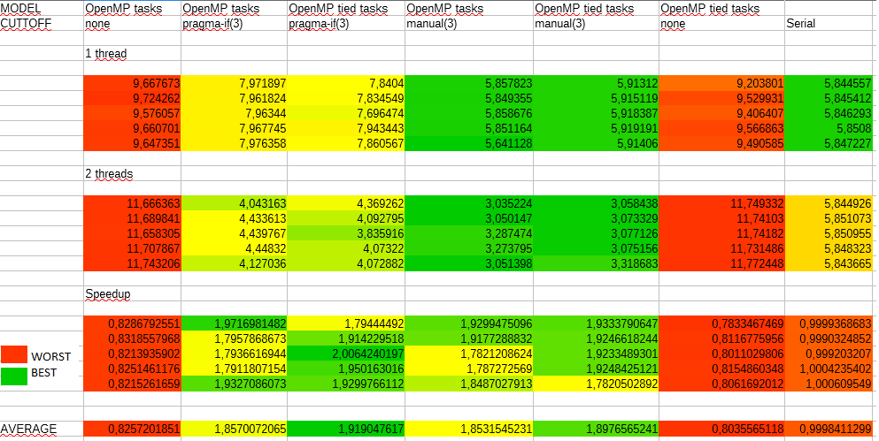

**Eric Tomás Zancanaro**
**Programação de Alto Desempenho - PPGI UFSM**
**Profª Andrea Schwertner Charão**

##Progama escolhido##

Aplicação NQueens da suite BOTS que encontra soluções para o problema das N rainhas. Disponível em: https://pm.bsc.es/projects/bots .

##O problema das N rainhas##
        
O problema das N rainhas é uma generalização do problema lógico das 8 rainhas. O problema das 8 rainhas prevê o posicionamento de 8 rainhas em um tabuleiro clássico de xadrez com dimensões 8 x 8, de forma que nenhuma das rainhas esteja sob ataque.

Para o problema das N rainhas, observamos a mesma limitação ao posicionamento das rainhas, mas o tabuleiro agora possui as dimensões N x N.

##Solução implementada##

 O algoritmo implementado faz a resolução do problema através de propagação e *backtracking*, posicionando uma rainha de cada vez em cada coluna do tabuleiro e observando as limitações estabelecidas pelas rainhas já posicionadas.
 
 Quando o algoritmo não encontra uma posição válida para uma das rainhas, ele retira a rainha da coluna anterior do tabuleiro e a reposiciona em outra posição válida.
        
 Estes passos são repetidos até que o algoritmo encontre todas as soluções possíveis para o tabuleiro e as rainhas em questão.

##O ambiente de testes##
Os testes foram executados em uma máquina executando o sistema Linux com OpenMP. Foram realizadas medições da execução do programa utilizando apenas 1 thread e medições utilizando 2 threads.
        
     As execuções encontraram soluções para um problema consistindo de 13 rainhas em um tabuleiro 13 x 13.

##Métricas coletadas##

Nas tabelas os melhores valores foram coloridos com o verde, enquanto os piores valores são representados pelo laranja escuro.
        
O programa das N rainhas é resolvido com 7 variações durante a execução do código. Essas variações são no modelo utilizado para as “tasks” do OpenMP e no “cuttoff” escolhido para o algoritmo de resolução do problema.
        
Para as execuções com apenas 1 thread, não vemos melhora alguma da execução paralela do programa em comparação com a versão serial, como é de se esperar.
        
Um fator que salta logo aos olhos do observador através desta tabela é o aumento no tempo de execução do algoritmo em duas das colunas da tabela, ambas quando o cuttoff estabelecido para o OpenMP é inexistente. Assim sendo este parâmetro possui importância na paralelização eficiente do código deste algoritmo.
        
Estas colunas, tais como a coluna da execução serial não serão consideradas quando tratarmos do speedup da aplicação, visto que existe um “speeddown” e as diferenças de método do OpenMP não são o foco deste trabalho.
        
O tempo de execução apresenta uma melhoria constante fora os casos apontados acima, de forma que os melhores tempo de execução foram encontrados para os casos em que o cuttoff manual foi utilizado.

Em relação ao speedup, mais importante do que o maior speedup absoluto, é a média obtida através das 5 execuções. Esta média, nos dá uma ideia melhor do quão efetiva foi a mudança para o maior número de threads, visto que a observação apenas do maior valor da métrica pode favorecer execuções anômalas.
       
Um exemplo disso é a segunda coluna da tabela, que apresenta duas execuções em que o speedup encontra-se no top 3 dos valores obtidos, porém as demais execuções apresentam um valor muito menos impressionante. Esta coluna apreseta a segunda pior média de speedup das quatro colunas em que esta métrica foi positiva.

Já as colunas 3 e 5 apresentam quatro altos valores para o speedup e apenas um valor mediano.

        
##Análise do código##
        
A paralelização do código da aplicação é realizada na função que faz a alocação de uma rainha na coluna. Em questão de código, esta paralelização é um constructo pragma encontrado dentro do laço for que aloca uma rainha em todas as posições possíveis em uma coluna.
        
No código serial, o algoritmo precisa alocar uma rainha em uma posição na coluna e testar se a posição é válida, seguindo então para a alocação da próxima rainha.
        
Paralelizado, o código permite que cada task do OpenMP faça a alocação de uma posição da coluna e chame os testes subsequentes e a alocação da rainha na próxima coluna.
        
Se podemos tratar de duas posições no tabuleiro “simultaneamente”, podemos esperar que exista um speedup na execução do algoritmo.

##Referências##

Intel, Developer Zone - omp tasks. Disponível em: https://software.intel.com/en-us/node/524540. Acesso em 15 de agosto de 2016.

Peter Alfeld,The N by N Queens Problem. Disponível em: http://www.math.utah.edu/~alfeld/queens/queens.html. Acesso em 15 de agosto de 2016.

Wikibooks, OpenMP. Disponível em:
https://en.wikibooks.org/wiki/OpenMP/Tasks. Acesso em 15 de agosto de 2016.
